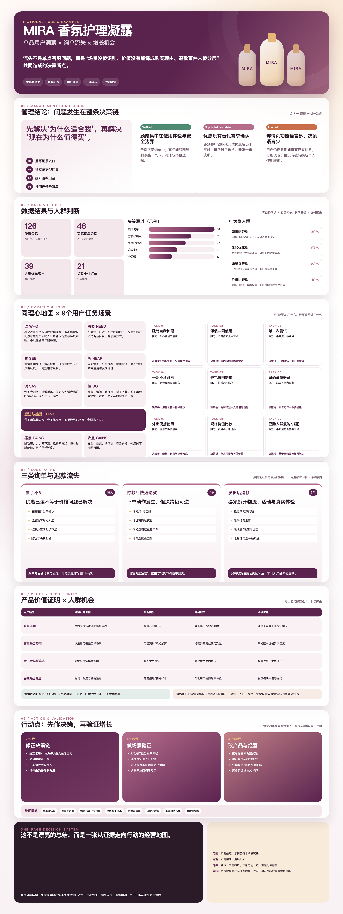

# Product VOC One-page Skill

A reusable Codex skill for evidence-graded, management-ready single-product VOC and inquiry-loss analysis, with a product-detail-driven 2160×5760 long infographic.

## What it fixes

Single-product reports often mix keyword hits with real inquiries, visitor profiles with buyer profiles, and shipment-stage refunds with product-experience refunds. They also tend to blame customer service for a problem that may originate in traffic, product expression, activity rules, fulfillment, or after-sale handling.

This skill fixes the analysis sequence and the evidence language, then renders the result in the product's own visual vocabulary.



## Fixed report structure

1. Management conclusion
2. Data results and people judgment
3. Empathy map and user-task scenes
4. View-no-buy, quick-refund, and post-shipment-refund analysis
5. Product value proof × people opportunities
6. Actions and validation metrics

## Quick start

```bash
npm install
npm run build
npm run render
npm run validate
npm run privacy
```

Outputs are written to `examples/example-report.html` and `assets/preview.png`.

To use your own data, copy `templates/report-config.example.json`, replace only public/non-sensitive content, then run:

```bash
node scripts/build_report.mjs path/to/config.json path/to/report.html
node scripts/render_report.mjs path/to/report.html path/to/report.png
node scripts/validate_report.mjs path/to/report.html
```

## Product-link workflow

When a product ID or link is available, inspect the official detail page in an authenticated browser session and extract the visual system: colors, texture, typography mood, shapes, photography treatment, and SKU images. Product-page claims are not considered verified until separate evidence is available.

## Privacy

This repository contains only a fictional example. Do not commit customer conversations, customer identifiers, order numbers, internal URLs, local filesystem paths, BI exports, cookies, tokens, or proprietary evidence files.

Binary assets fail the privacy scan by default. A reviewed asset is accepted only when its SHA-256 exactly matches `privacy-reviewed-binaries.json`; any image change requires renewed review.

## License

MIT

